# Movie_api

## Descrição do projeto - Project description

## Requisitos - Requirements

- Python 3.12.3 ou superior
- Django e dependências listadas no arquivo `requirements.txt`

## Instalação

1. Clone o repositório:
https...
Navegue até o diretório do projeto: 'cd Movie-api'

2. Crie e ative um ambiente virtual (opcional mas recomendado):
- Criando ambiente:
python -m venv venv

- Ativando ambiente:
- Windows: venv\Scripts\activate
- Linux: venv/bin/activate

3. Instale as dependências do projeto:
pip install -r .\requirements.txt

4. Instale as dependências de desenvolvimento:
pip install -r .\requirements_dev.txt

5. Aplique as migrações no banco de dados:
python manage.py migrate

6. O projeto estará acessível em: 
(http://localhost:8000)
(http://localhost:8000/admin)
Postman

## Contribuição

Contribuições são bem-vindas! Para contribuir com o projeto:

1. Faça um fork do repositório.
(Um "fork" é uma cópia do repositório do projeto para sua própria conta no GitHub (ou outra plataforma de hospedagem). Isso permite que você trabalhe em mudanças sem afetar o repositório original.)

2. Crie uma branch para sua feature (`git checkout -b feature/nova-feature`).
(Antes de começar a trabalhar em uma nova funcionalidade ou correção, crie uma branch separada para ela. Isso ajuda a manter o código principal do projeto limpo e facilita a revisão das suas alterações, substitua nova-feature pelo nome descritivo da sua alteração.)

3. Faça commit das mudanças (`git commit -am 'Adiciona nova feature'`).
(Após implementar suas alterações, faça commits frequentes e significativos para a branch que você criou.)

4. Faça push para a branch (`git push origin feature/nova-feature`).
(Depois de fazer os commits das suas mudanças, envie-as para o seu fork no GitHub.)

5. Abra um Pull Request.
(Finalmente, vá até o repositório original no GitHub (ou outra plataforma) e abra um Pull Request.
Descreva suas alterações de forma clara e concisa no PR.
Isso permite que os mantenedores do projeto revisem suas alterações, discutam e, se aprovadas, as incorporem no projeto principal.)

7. Dicas para Contribuir:
Mantenha o foco: Concentre-se em uma única alteração por branch para facilitar a revisão.
Seja claro: Descreva suas alterações e intenções no PR para facilitar a revisão pelos mantenedores do projeto.
Siga as convenções de código: Mantenha o estilo de código e as práticas existentes no projeto.

## Contato

Para mais informações, entre em contato via email: matheus9mendonca@hotmail.com

## Imagens do Projeto

## Dashboard da área de Admin
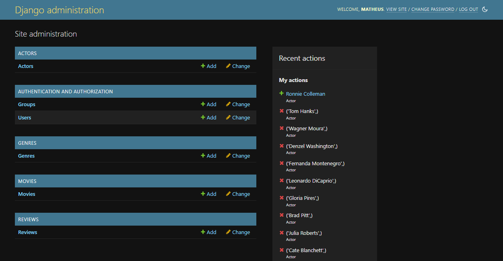
*Visão geral do painel de administração.*

## Formulário de Registro de Usuários pelo Admin
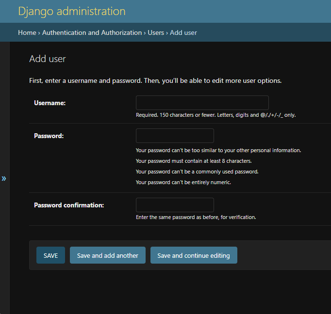
*Formulário utilizado para registrar novos usuários.*

## Permissões dos Usuários Concebidas pelo Admin
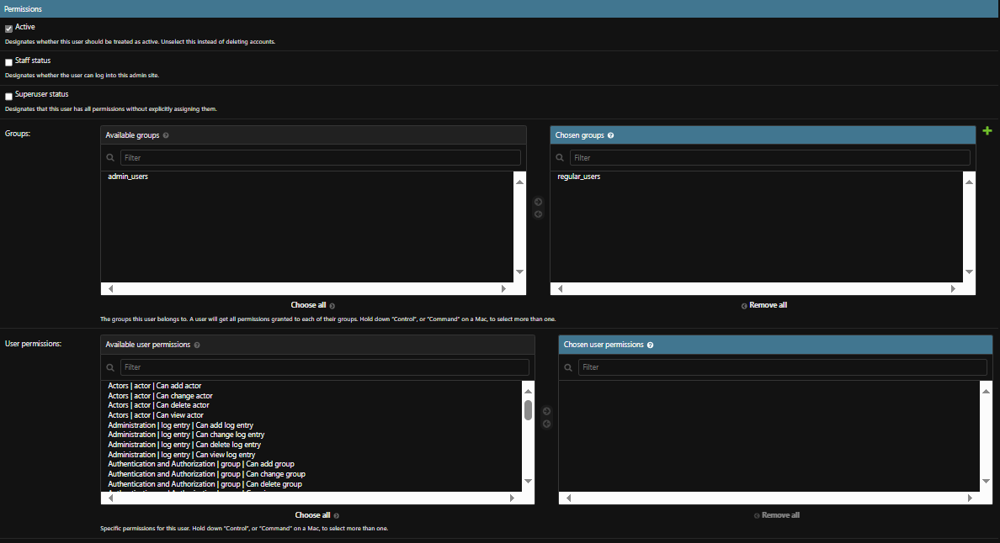
*Interface para definir permissões individuais dos usuários.*

## Grupos de Permissões
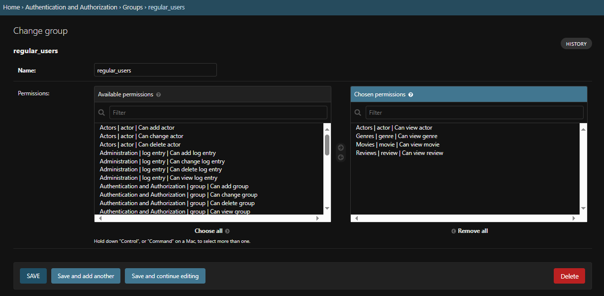
*Interface para gerenciar grupos de permissões.*

## Sessão de Movies
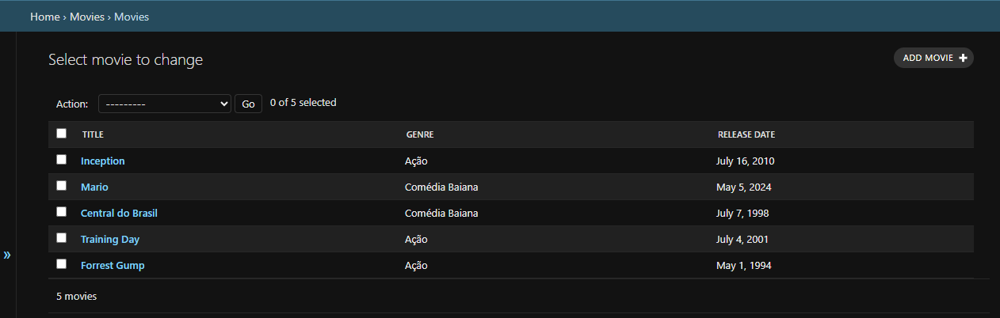
*Lista de filmes disponíveis no sistema.*
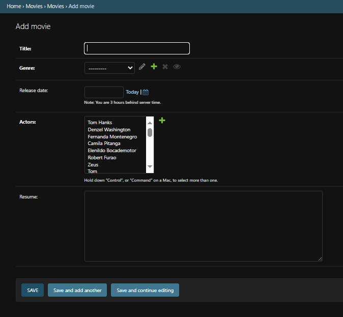
*Formulário para adicionar novos filmes.*

## Sessão de Actors
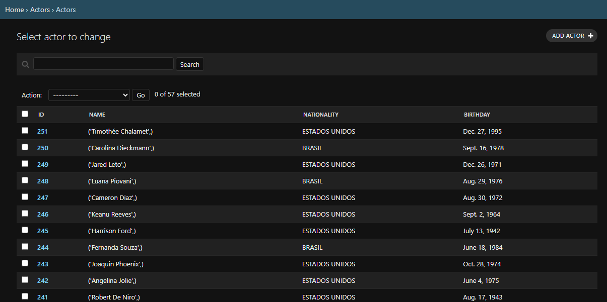
*Lista de atores registrados no sistema.*
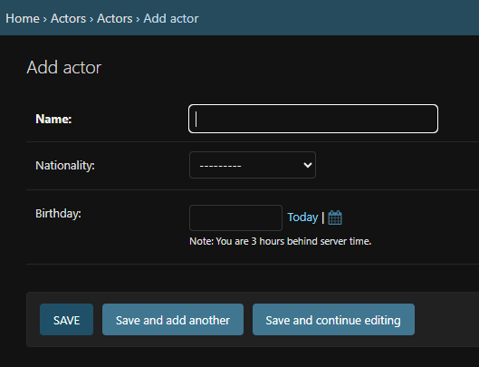
*Formulário para adicionar novos atores.*

## Sessão de Genres
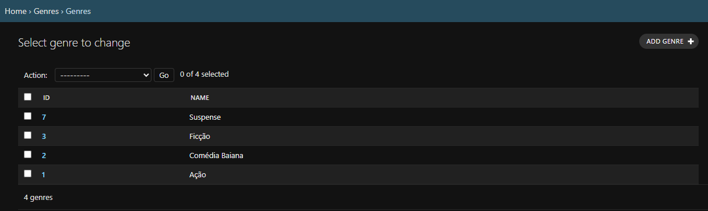
*Lista de gêneros de filmes.*
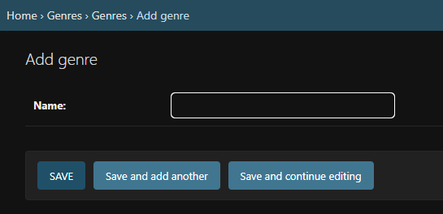
*Formulário para adicionar novos gêneros.*

## Sessão de Reviews
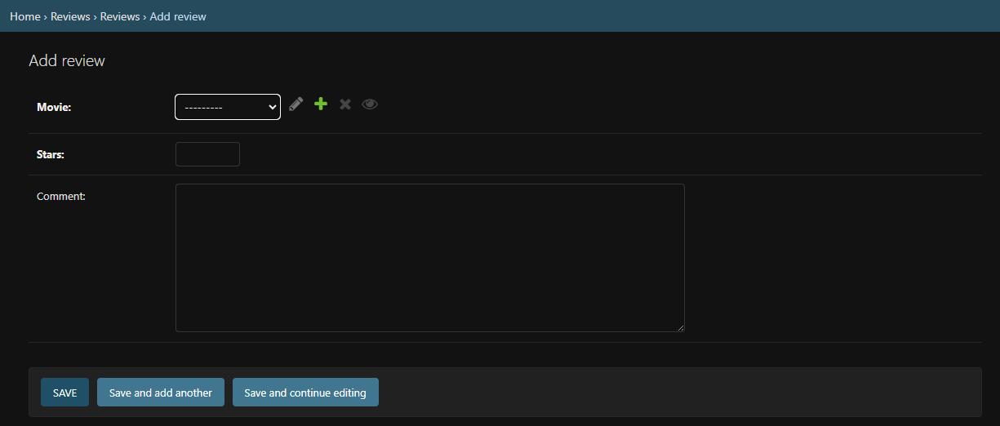
*Formulário para adicionar novas resenhas de filmes.*
